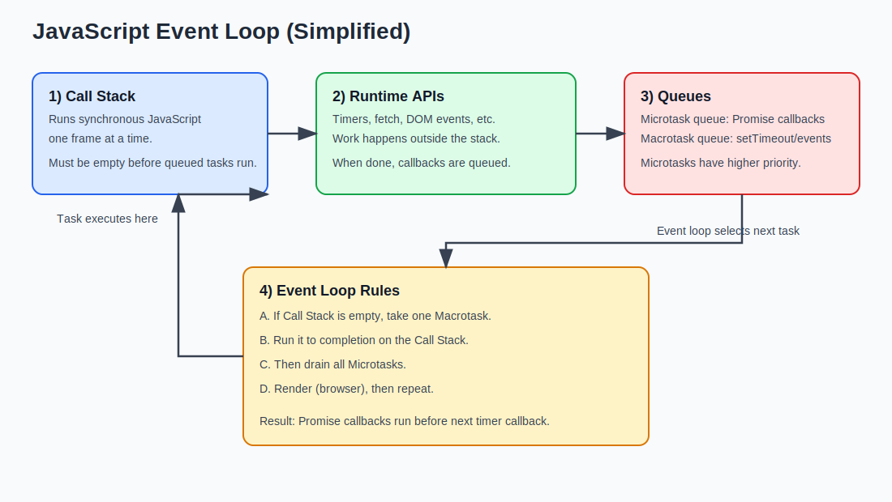
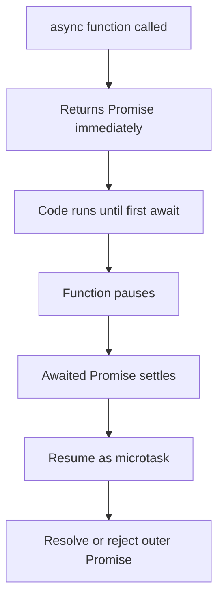

# Async JavaScript Mini Project (Core JS Only)

This small educational project demonstrates asynchronous programming in **vanilla JavaScript** (no frameworks).

## Project Goals

- Explain the theory behind async JavaScript (thesis-style notes).
- Show visual schemas of how async flow works.
- Provide runnable code examples for core async patterns.

## Structure

- `examples/01_event_loop_order.js` - macrotask vs microtask execution order.
- `examples/02_callbacks_to_promises.js` - callback style and Promise refactor.
- `examples/03_async_await.js` - `async/await` flow and error handling.
- `examples/04_sequential_vs_parallel.js` - performance difference.
- `examples/05_promise_combinators.js` - `all`, `allSettled`, `race`, `any`.
- `examples/06_abort_controller.js` - cancellation with `AbortController`.
- `examples/07_fetch_api.js` - HTTP request with `fetch` and JSON parsing.
- `demo/index.html` + `demo/main.js` - browser mini-demo without frameworks.

---

## 1) Theoretical Part (Thesis Notes)

### 1.1 Why Async JS Exists

JavaScript in a browser tab (or Node.js main thread) executes code on a **single main thread**. If a slow operation blocks that thread (network, timer waiting, file I/O simulation), the app becomes unresponsive.

Asynchronous programming allows JS to:

- start long-running operations,
- continue other work,
- process results later when ready.

### 1.2 Event Loop Model

Core components:

1. **Call Stack**: currently executing synchronous frames.
2. **Web APIs / Runtime APIs**: timers, fetch, DOM events, etc.
3. **Task Queue (Macrotasks)**: `setTimeout`, `setInterval`, UI events.
4. **Microtask Queue**: `Promise.then/catch/finally`, `queueMicrotask`.
5. **Event Loop**: moves tasks to the call stack when stack is empty.

Important rule:

- After one macrotask finishes, the engine runs **all pending microtasks** before the next macrotask.

### 1.3 Async Evolution

1. **Callbacks**: first approach, but can lead to callback nesting and difficult error flow.
2. **Promises**: represent future result (`pending`, `fulfilled`, `rejected`) and improve composition.
3. **Async/Await**: syntax over Promises for cleaner, synchronous-looking flow.

### 1.4 Concurrency Patterns

- **Sequential**: await each step one by one (simple but slower when tasks are independent).
- **Parallel**: start tasks together, await combined completion (`Promise.all`) for better total time.

### 1.5 Error Handling Patterns

- Callback style: pass `(err, result)`.
- Promise style: `.catch()`.
- Async/Await style: `try/catch` around `await`.

### 1.6 Cancellation and Timeouts

Promises don’t cancel automatically. In modern JS, cancellation is commonly modeled with `AbortController` and `AbortSignal`.

### 1.7 Common Pitfalls

- Forgetting to `await` a Promise.
- Running independent async calls sequentially by mistake.
- Unhandled rejections.
- Misunderstanding microtask vs macrotask order.

---

## 2) Schemas

### 2.1 Event Loop Schema



How to read this schema:

1. Synchronous code runs on the **Call Stack**.
2. Async operations (`setTimeout`, `fetch`, events) are handled by **Runtime APIs**.
3. Completed callbacks go to queues:
   - **Microtask queue** (`Promise.then`, `queueMicrotask`)
   - **Macrotask queue** (`setTimeout`, UI events)
4. The Event Loop first takes one macrotask (if stack is empty), then drains all microtasks.
5. Then the cycle repeats.


### 2.2 Async/Await Under the Hood



---

## 3) How to Run

### Node examples

From project root:

```bash
node examples/01_event_loop_order.js
node examples/02_callbacks_to_promises.js
node examples/03_async_await.js
node examples/04_sequential_vs_parallel.js
node examples/05_promise_combinators.js
node examples/06_abort_controller.js
node examples/07_fetch_api.js
```

`07_fetch_api.js` needs internet access to call the public API.

### Browser demo

Open `demo/index.html` directly in browser.

